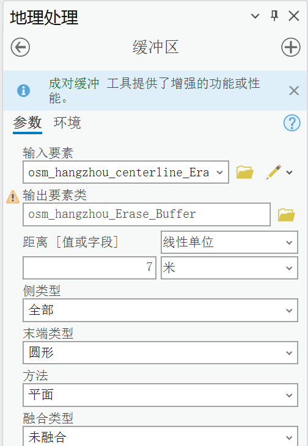

# 利用OSM路网生成地块/地块划分

**Parcel Generation with OSM Road Network**

本代码链接：[利用OSM路网生成地块](https://github.com/Liuzhizhiooo/Parcel-Generation-with-OSM-Road-Network)

十分感谢kingsley0107公开的代码：https://github.com/kingsley0107/road_regularization

和上述项目的区别如下：

+ 记录了处理流程对应的`Arcgis Pro`软件操作

+ 描述了处理的基本流程，添加了一些后处理的代码

+ 进行了一些个人风格化的改动，简化了代码结构，增加了注释

## 0. 准备工作

### 数据下载

[Geofabrik Download Server](https://download.geofabrik.de/asia/china.html#)

下载的是2013-10-10的数据


### 软件安装

需要安装`Arcgis Pro 3.x`，资源自寻

`Arcmap`和`Arcgis Pro`都可以实现后续的处理，但是`Arcmap`的`arcpy`支持的`python`版本为`2.x`，后续用代码实现起来不太方便，连`f-string`都不支持，因此考虑使用`Arcgis Pro`

> https://cdn.renhai-lab.tech/archives/4.2.2-ArcGIS%20Pro%E5%92%8CArcMap%E7%9A%84%E5%8C%BA%E5%88%AB


安装好软件以后，利用如下命令克隆环境，防止后续把原始`Arcgis Pro`环境弄坏了

```sh
conda create -n arcgispro --clone D:\software\ArcgisPro\bin\Python\envs\arcgispro-py3
```


## 1. 基本处理流程

参考论文[Social functional mapping of urban green space using remote sensing and social sensing data - ScienceDirect](https://www.sciencedirect.com/science/article/pii/S0924271618302910)对地块生成的描述，大致分为如下几步：

1. 删除冗余的道路，避免过度分割（自己进行处理）

2. 移除不必要的细节，包括去除短于500 m的悬挂线和延长道路末端100  m以连接原本不相连的线路

3. 根据道路等级进行分级缓冲区构建
4. 去除无意义的地块，把面积小于5000平方米的地块筛除

其中，较为复杂的是第二步


## 2. 数据处理-Arcgis Pro交互版

这里展示一遍如何用软件完成交互，便于后续代码版进行批量处理的理解，前面有一小部分用的是QGIS处理

### 2.1 筛选出杭州市内的道路并展示

> OSM道路等级：https://wiki.openstreetmap.org/wiki/Key:highway
>
> 道路展示符号：https://blog.csdn.net/QGISClass/article/details/113889129

由于使用shp文件，铁路和道路文件是分开的，处理起来麻烦些

因此，这里使用的是`china-231010.osm.pbf`，只加载`lines`图层即可

得到`osm_hangzhou.shp`


对`osm_hangzhou.shp`应用如下过滤规，导出为`osm_hangzhou-select.shp`并进行展示：

```
"highway"  IN  ('motorway','motorway_link','trunk','trunk_link','primary','primary_link', 'secondary', 'secondary_link', 'tertiary', 'tertiary_link', 'residential', 'unclassified') or "railway"  IN ('rail')
```


|           类别           |     中文     | 等级 | 缓冲距离 |
| :----------------------: | :----------: | :--: | :------: |
|     motorway(_link)      |   高速公路   |  1   |    40    |
|       trunk(_link)       | 国道、快速路 |  1   |    40    |
|      primary(_link)      |    主干道    |  2   |    20    |
|     secondary(_link)     |    次干道    |  2   |    20    |
|     tertiary(_link)      |    次干道    |  2   |    20    |
| residential,unclassified |     支路     |  3   |    10    |


### 2.2 提取中心线

> 后续每一步的处理结果可以看https://github.com/kingsley0107/road_regularization

这一步主要是简化道路，和重叠/接近的多个线要素进行合并，只提取中心线

+ 先把投影从`EPSG:4326`转为`EPSG:3857`，`Project`

  > 后续提取centerline的时候使用`EPSG:4326`会报错

+ 生成十米的缓冲区，`Buffer`

+ 融合，`Dissolve`

  > 注意，融合这一步不能合并在缓冲区生成过程中实现，后续提取中心线会出报错:"000072: 无法处理具有 OID <值> 的要素。"

+ 提取中心线，`Polygon To Centerline`


### 2.3 路网优化

+ 非闭合道路延展，`ExtendLine`


+ 提取断头路（悬挂线）的点

注意，工作目录是: `*.gbd/topo`

| 步骤               | 英文                         | 参数                                                         |
| ------------------ | ---------------------------- | ------------------------------------------------------------ |
| 创建要素数据集     | `CreateFeatureDataset`       |  |
| 要素类至要素类     | `FeatureClassToFeatureClass` |  |
| 创建拓扑           | `CreateTopology`             |  |
| 向拓扑中添加要素类 | `AddFeatureClassToTopology`  |  |
| 添加拓扑规则       | `AddRuleToTopology`          |  |
| 拓扑验证           | `ValidateTopology`           |  |
| 导出拓扑错误       | `ExportTopologyErrors`       |  |


+ 过滤长度低于threshold的毛刺道路

|                              |                              |                                                              |
| ---------------------------- | ---------------------------- | ------------------------------------------------------------ |
| 复制图层                     | `MakeFeatureLayer`           |  |
| 找到与错误拓扑点有交集的线段 | `SelectLayerByLocation`      |  |
| 导出所选线段                 | `CopyFeatures`               |  |
| 计算线段长度                 | `AddGeometryAttributes`      |  |
| 筛选出过短的线段（<500m）    | `FeatureClassToFeatureClass` |  |
| 擦除过短的悬挂线             | `Erase`                      |  |


+ 空间连接，把之前的属性重新赋予处理完的线段

|                            |               |                                                              |
| -------------------------- | ------------- | ------------------------------------------------------------ |
| 把新生成的线进行缓冲区     | `Buffer`      |  |
| 利用最大重叠区进行一一对应 | `SpatialJoin` |  |
| 利用位于区域内进行对应     | `SpatialJoin` |  |


最终可以得到`道路延伸优化(100m)`,`过短(<500m)悬挂道路筛除`后的路网


### 2.4 生成地块

根据类别生成缓冲距离字段，先新建一个字段，然后右击该列计算字段


```python
def getDis(x, y):
    if x in ['motorway','motorway_link','trunk','trunk_link']:
        return 40
    if x in ['primary','primary_link', 'secondary', 'secondary_link', 'tertiary', 'tertiary_link']:
        return 20
    if x in ['residential', 'unclassified']:
        return 10
    if y in ['rail']:
        return 40
    return 10
```


+ 按类生成缓冲区并合并，要素转面，然后删除掉面积最大的那个面（道路面），即可得到`land parcel`


+ 筛除面积过小的数据


# 3. 数据处理-代码版

```python
# 目录树
├─data  # 数据文件夹
├─results  # 结果文件夹
├─main.py  # 主函数
├─config.py  # 配置文件
├─utils.py  # 工具函数
```

## 主函数

`main.py`

```python
# -*- coding: utf-8 -*-
from utils import *
import time
from os.path import join

def Process_Body(smooth_level: int = 30, extend_distance: int = 100, spike_keep: int = 500):
    """
    处理的主题函数
    """
    try:
        arcpy.CreateFileGDB_management(FILE_ROOT, DATABASE_NAME)
    except:
        print("gdb already exist")
    arcpy.env.workspace = join(FILE_ROOT, DATABASE_NAME)
    arcpy.env.outputMFlag = "DISABLE_M_VALUE"  # 禁用M值输出
    arcpy.env.overwriteOutput = True
    print(f"config workspace : {arcpy.env.workspace}")

    # 1. 裁剪 + 按属性筛选出所需要的道路
    osm_clip = Clip_Road(BOUNDARY_PATH, OSM_PATH)
    select_osm = Select_Road(osm_clip)
    raw_road = select_osm

    # 2. 缓冲区后获取中心线
    centerline = Convert_Centerline(select_osm, smooth_level)
    print(f"Convert_centerline Finish:{centerline}")

    # 3. 延伸中心线
    extendedlines = Extend_Road(centerline, extend_distance)
    print("Extend roads Finish")

    # 4. 检查拓扑
    err_point = Check_Topo(extendedlines)
    print("Check Topo Finish")

    # 5. 清除过短的悬挂线
    master_road = Clean_Spike(extendedlines, err_point, spike_keep, keep_spike=False)
    print("Clean Spike Finish")

    # 6. 把属性连接回来
    master_road = Join_Attributes(raw_road, master_road)
    road_result = Delete_Fields(master_road)

    # 7. 生成地块
    road_result = "road_results"
    parcel = Create_Parcel(road_result)
    return parcel

if __name__ == '__main__':
    print(f"😈😈😈😈😈            Begin process                     😈😈😈😈😈")
    start_time = time.time()
    output_path = Process_Body(smooth_level=10, extend_distance=100, spike_keep=500)
    print(f"🤭🤭🤭🤭🤭            processed                          🤭🤭🤭🤭🤭")
    print(f"🎉🎉🎉🎉🎉            time used: {time.time()- start_time}       🎉🎉🎉🎉🎉")
    print(f"🚀🚀🚀🚀🚀            result: {output_path}      🚀🚀🚀🚀🚀")
```
